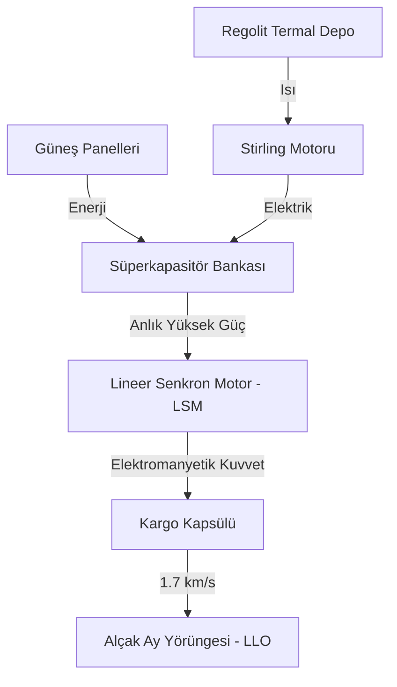

# ☄️ Elektromanyetik Fırlatma Fiziği ve Sistem Mimarisi

Bu döküman, Ay yüzeyinden yörüngeye kargo gönderimi için kullanılan katapult sisteminin derinlemesine fiziksel analizini içerir.

## 🏗️ Sistem Mimarisi

## 📉 Enerji ve İvme Analizi

### 1. Kinetik Enerji Gereksinimi
Kargonun yörünge hızına ($v$) ulaşması için gereken net iş ($W$):
$$W = \Delta E_k = \frac{1}{2} m v^2$$

**Örnek:** 250 kg kargo için 1.7 km/s hız:
$$E_k = 0.5 \cdot 250 \cdot (1700^2) = 361,250,000 \, \text{Joule} \approx 361 \, \text{MJ}$$

### 2. Ray Uzunluğu ve G-Kuvveti Sınırı
İnsanlı veya hassas kargo gönderimlerinde ivme ($a$) kritik bir kısıttır. İvme sabit kabul edilirse ray uzunluğu ($L$):
$$L = \frac{v^2}{2a}$$

| Hedef Hız (km/s) | İvme (G) | Ray Uzunluğu (km) |
|------------------|----------|-------------------|
| 1.7              | 10       | 14.7              |
| 1.7              | 30       | 4.9               |
| 1.7              | 50       | 2.9               |

### 3. Manyetik Verimlilik Factors
Sistemdeki enerji kayıpları ($\eta$) şunları içerir:
- **Ohmik Kayıplar:** Bobinlerdeki direnç ısınması.
- **Eddy Akımları:** Ray yapısındaki indüklenen akımlar.
- **Hava Direnci:** Ay vakumunda ihmal edilebilir ($\approx 0$).

Net Enerji İhtiyacı: $E_{total} = \frac{E_k}{\eta}$

---

## 🛠️ Operasyonel Limitler
- **Maksimum Akım:** 50,000 Amper
- **Kondansatör Deşarj Süresi:** < 10 saniye
- **Ray Soğuma Süresi:** 1 saat (fırlatma başına)
